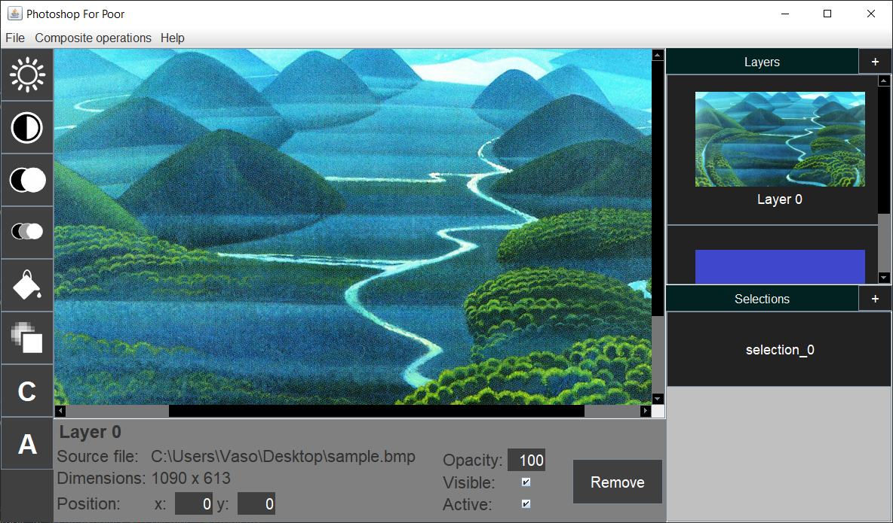

# Image_Editor

A simple image editing program with features like working with layers, defining selections and applying basic and composite operations on images. Suitable for .bmp and .pam image formats.

The project has two versions: one written in C++ as a console application and one written in Java as a GUI application. The main version - the Java application - heavily depends on the C++ program as it is basically integrated into the Java code. In other words, the Java version provides graphical user interface and some other simple functionalities, where the C++ program (being the core of the project) is only being called by the Java code (although it can also run independently as a console application). 

The accent of this project is on object-oriented design and intensive use of data structures and algorithms from standard Java and C++ libraries. 

